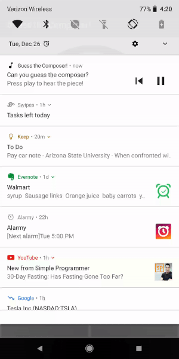

# Exercise 6 - Add Media Button Receiver

## _QuizActivity.java_

#### 1. Create a static inner class that extends `BroadcastReceiver` and implement the `onReceive()` method. [[code][1]]
```java
    public static class MediaReceiver extends BroadcastReceiver {
```


#### 2. Call` MediaButtonReceiver.handleIntent` and pass in the incoming intent as well as the `MediaSession` object to forward the intent to the `MediaSession.Callbacks`. [[code][2]]
```java
        @Override
        public void onReceive (Context context, Intent intent){
             MediaButtonReceiver.handleIntent(mMediaSession, intent);
        }
```


## _AndroidManifest.xml_

#### 3. Create a receiver tag for the receiver you create in `QuizActivity`. Add an `IntentFilter` for the `MEDIA_BUTTON` intent. [[code][3]]
```xml
        <receiver android:name=".QuizActivity$MediaReceiver">
            <intent-filter>
                <action android:name="android.intent.action.MEDIA_BUTTON"/>
            </intent-filter>
        </receiver>
```


## _Class Reference_

### [MediaButtonReceiver](https://developer.android.com/reference/android/support/v4/media/session/MediaButtonReceiver.html)

|Return Type | Method Name |
|----------------------------------------------------------------------------------------|-----------------------------------------------------------------------------------------------------------------------------------------------------------------------------------------------------------------------------------------------------------------------------------------------------------------------------------------------------------------------------------------------------------------------------------------------------------------------------------------------------------------------------------------------------------------------------------------------------------------------------------------------------------------------------------------------------------------------------------------------------------------------------------------------------------------------------------------------------------------------------------------------------------------------------------------------------------------------------------------------------------------------------------------------------------------------------------------------------------------------------------------------------------------------------------------------------------------------------------------------------------------------------------------------------------------------------------------------------------------------------------------------------------------------------------------------------------------|
| `static` [KeyEvent](https://developer.android.com/reference/android/view/KeyEvent.html) | [handleIntent](https://developer.android.com/reference/android/support/v4/media/session/MediaButtonReceiver.html#handleIntent(android.support.v4.media.session.MediaSessionCompat))`(`[MediaSessionCompat](https://developer.android.com/reference/android/support/v4/media/session/MediaSessionCompat.html) `mediaSessionCompat,` [Intent](https://developer.android.com/reference/android/content/Intent.html) `intent)` <br/>Extracts any available [KeyEvent](https://developer.android.com/reference/android/view/KeyEvent.html) from an [ACTION_MEDIA_BUTTON](https://developer.android.com/reference/android/content/Intent.html#ACTION_MEDIA_BUTTON) intent, passing it onto the [MediaSessionCompat](https://developer.android.com/reference/android/support/v4/media/session/MediaSessionCompat.html) using [dispatchMediaButtonEvent(KeyEvent)](https://developer.android.com/reference/android/support/v4/media/session/MediaControllerCompat.html#dispatchMediaButtonEvent(android.view.KeyEvent)), which in turn will trigger callbacks to the [MediaSessionCompat.Callback](https://developer.android.com/reference/android/support/v4/media/session/MediaSessionCompat.Callback.html) registered via [setCallback(MediaSessionCompat.Callback)](https://developer.android.com/reference/android/support/v4/media/session/MediaSessionCompat.html#setCallback(android.support.v4.media.session.MediaSessionCompat.Callback)). |


## _Screenshots_



[1]: https://github.com/aaroncrutchfield/AdvancedAndroid_ClassicalMusicQuiz/blob/729fbaf74565c5860d17ddd89b7ad70694d91f39/app/src/main/java/com/example/android/classicalmusicquiz/QuizActivity.java#L433
[2]: https://github.com/aaroncrutchfield/AdvancedAndroid_ClassicalMusicQuiz/blob/729fbaf74565c5860d17ddd89b7ad70694d91f39/app/src/main/java/com/example/android/classicalmusicquiz/QuizActivity.java#L439-L442
[3]: https://github.com/aaroncrutchfield/AdvancedAndroid_ClassicalMusicQuiz/blob/729fbaf74565c5860d17ddd89b7ad70694d91f39/app/src/main/AndroidManifest.xml#L35-L39