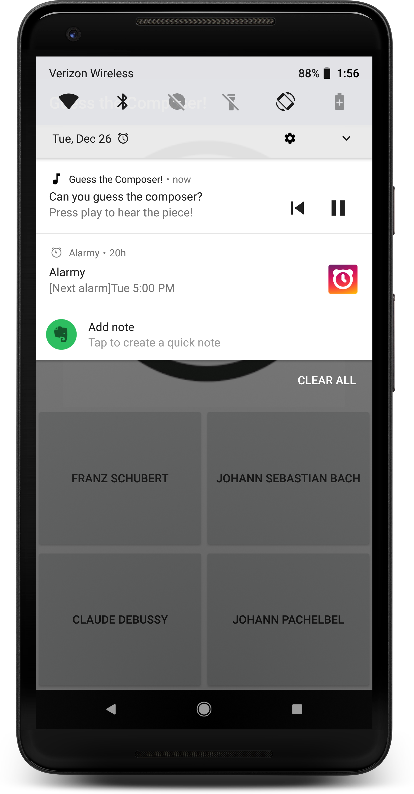

# Exercise 5 - Add MediaStyle Notification


## _QuizActivity.java_

#### 1. Create a method that shows a `MediaStyle` notification with two actions (play/pause, skip to previous). Clicking on the notification should launch this activity. It should take one argument that defines the state of `MediaSession`. [[code][1]]
```java
    private void showNotification(PlaybackStateCompat state){
        // Initialize the notification builder
        NotificationCompat.Builder builder = new NotificationCompat.Builder(this);


        int icon;
        String play_pause;
        // If playing, show the pause icon and set the play_pause string to 'pause'
        if(state.getState() == PlaybackStateCompat.STATE_PLAYING){
            icon = R.drawable.exo_controls_pause;
            play_pause = getString(R.string.pause);
        } else  {
            // Otherwise, show the play icon and set the play_pause string to 'play'
            icon = R.drawable.exo_controls_play;
            play_pause = getString(R.string.play);
        }


        // Create a notification action to handle play and pause
        NotificationCompat.Action playPauseAction = new NotificationCompat.Action(
                icon,
                play_pause,
                MediaButtonReceiver.buildMediaButtonPendingIntent(
                        this, PlaybackStateCompat.ACTION_PLAY_PAUSE));


        // Create a notification action to handle skip to previous
        NotificationCompat.Action restartAction = new NotificationCompat.Action(
                R.drawable.exo_controls_previous,
                getString(R.string.restart),
                MediaButtonReceiver.buildMediaButtonPendingIntent(
                        this, PlaybackStateCompat.ACTION_SKIP_TO_PREVIOUS));


        // Create a pending intent to pass to the notification builder
        PendingIntent contentPendingIntent = PendingIntent.getActivity(
                this,
                0,
                new Intent(this, QuizActivity.class),
                0);


        // Set up the notification build
        builder.setContentTitle(getString(R.string.guess))
                .setContentText(getString(R.string.notification_text))
                .setContentIntent(contentPendingIntent)
                .setSmallIcon(R.drawable.ic_music_note)
                .setVisibility(NotificationCompat.VISIBILITY_PUBLIC)
                .addAction(restartAction)
                .addAction(playPauseAction)
                .setStyle(new NotificationCompat.MediaStyle()
                        .setMediaSession(mMediaSession.getSessionToken())
                        .setShowActionsInCompactView(0, 1));


        // Get the notification manager from the system service
        mNotificationManager = (NotificationManager) getSystemService(NOTIFICATION_SERVICE);
        // Call notify on the notification manager to display the notification
        mNotificationManager.notify(0, builder.build());
    }
```


#### 2. Call the method to show the notification, passing in the `PlayBackStateCompat` object. [[code][2]]
```java
        showNotification(mStateBuilder.build());
```


#### 3. Cancel any notifications when releasing the `ExoPlayer`. [[code][3]]

```java
        mNotificationManager.cancelAll();
```


## _Class Reference_
MediaButtonReciever
    buildMediaButtonPendingIntent

NotificationCompat.MediaStyle()

### [MediaButtonReceiver](https://developer.android.com/reference/android/support/v4/media/session/MediaButtonReceiver.html)

|Return Type  |Method Name  |
|-------------------------------------------------------------------------------------------------|------------------------------------------------------------------------------------------------------------------------------------------------------------------------------------------------------------------------------------------------------------------------------------------------------------------------------------------------------------------------------------------------------------------------------------------------------------------------------------------------------------------------------|
| `static` [PendingIntent](https://developer.android.com/reference/android/app/PendingIntent.html) | [buildMediaButtonPendingIntent](https://developer.android.com/reference/android/support/v4/media/session/MediaButtonReceiver.html#buildMediaButtonPendingIntent)`(`[Context](https://developer.android.com/reference/android/content/Context.html) `context,` [ComponentName](https://developer.android.com/reference/android/content/ComponentName.html) `mbrComponent, long action)` <br/>Creates a broadcast pending intent that will send a media button event. |


### [Notification.MediaStyle](https://developer.android.com/reference/android/app/Notification.MediaStyle.html)

|Return Type   |Method Name   |
|-------------------------------------------------------------------------------------------------------------|--------------------------------------------------------------------------------------------------------------------------------------------------------------------------------------------------------------------------------------------------------------------------------------------------------------------------------------------------------------------------------------------------------------------------------------------------------------------------------------------------------|
| [Notification.MediaStyle](https://developer.android.com/reference/android/app/Notification.MediaStyle.html) | [setMediaSession](https://developer.android.com/reference/android/app/Notification.MediaStyle.html#setMediaSession(android.media.session.MediaSession.Token))`(`[MediaSession.Token](https://developer.android.com/reference/android/media/session/MediaSession.Token.html) `token)` <br/>Attach a [MediaSession.Token](https://developer.android.com/reference/android/media/session/MediaSession.Token.html) to this Notification to provide additional playback information and control to the SystemUI. |
| [Notification.MediaStyle](https://developer.android.com/reference/android/app/Notification.MediaStyle.html) | [setShowActionsInCompactView](https://developer.android.com/reference/android/app/Notification.MediaStyle.html#setShowActionsInCompactView(int...))`(int... actions)` <br/>Request up to 3 actions (by index in the order of addition) to be shown in the compact notification view.                                                                                                                                                                                                                        |


## _Screenshots_



[1]: https://github.com/aaroncrutchfield/AdvancedAndroid_ClassicalMusicQuiz/blob/7b8b049c779773253b715ebbceb9d1dd1b46bf10/app/src/main/java/com/example/android/classicalmusicquiz/QuizActivity.java#L194-L247
[2]: https://github.com/aaroncrutchfield/AdvancedAndroid_ClassicalMusicQuiz/blob/7b8b049c779773253b715ebbceb9d1dd1b46bf10/app/src/main/java/com/example/android/classicalmusicquiz/QuizActivity.java#L409
[3]: https://github.com/aaroncrutchfield/AdvancedAndroid_ClassicalMusicQuiz/blob/7b8b049c779773253b715ebbceb9d1dd1b46bf10/app/src/main/java/com/example/android/classicalmusicquiz/QuizActivity.java#L278
