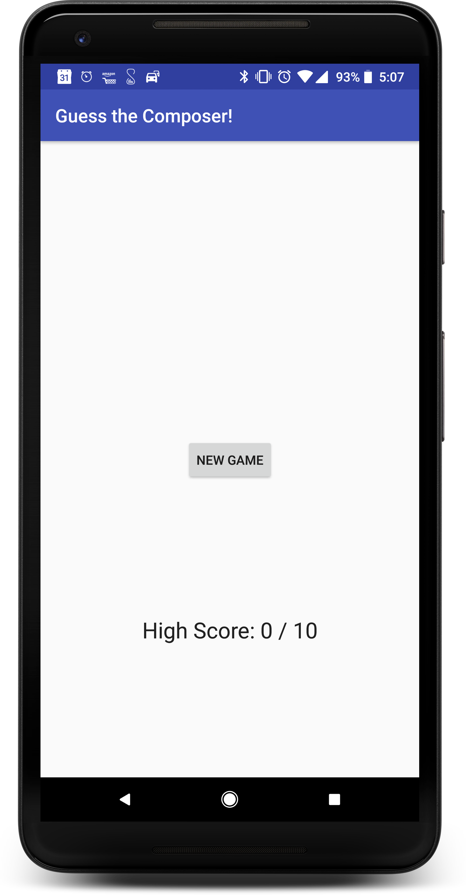

# Exercise 3 - ExoPlayerEvent Listening

## *QuizActivity.java*

#### 1. Have this Activity implement `ExoPlayer.EventListener` and add the required methods.[[code][1]]
```java
       public class QuizActivity extends AppCompatActivity implements View.OnClickListener, ExoPlayer.EventListener {
```

#### 2. Set the `ExoPlayer.EventListener` to this activity.[[code][2]]

```java
            mExoPlayer.addListener(this);
```


#### 3. Add conditional logging statements to the `onPlayerStateChanged()` method that log when ExoPlayer is **playing** or **paused**.[[code][3]]

```java
    @Override
    public void onPlayerStateChanged(boolean playWhenReady, int playbackState) {
        if ((playbackState == ExoPlayer.STATE_READY) && playWhenReady){
            Log.d(TAG, "onPlayerStateChanged: PLAYING");
        } else if((playbackState == ExoPlayer.STATE_READY)){
            Log.d(TAG, "onPlayerStateChanged: PAUSED");
        }
    }
```

## *Class Reference*

### Interface [ExoPlayer.EventListener](https://google.github.io/ExoPlayer/doc/reference/com/google/android/exoplayer2/ExoPlayer.EventListener.html)

|Return Type    |Method Name|
|:---|:---|
|void    | [onPlayerStateChanged](https://google.github.io/ExoPlayer/doc/reference/com/google/android/exoplayer2/Player.EventListener.html#onPlayerStateChanged-boolean-int-)`(boolean playWhenReady, int playbackState)`<br/>Called when the value returned from either [`Player.getPlayWhenReady()`](https://google.github.io/ExoPlayer/doc/reference/com/google/android/exoplayer2/Player.html#getPlayWhenReady--) or [`Player.getPlaybackState()`](https://google.github.io/ExoPlayer/doc/reference/com/google/android/exoplayer2/Player.html#getPlaybackState--)changes.|

## *Screenshots*



[1]:https://github.com/aaroncrutchfield/AdvancedAndroid_ClassicalMusicQuiz/blob/ac3bc51a8dd16e89ef60214fd1b9d13e84286b1b/app/src/main/java/com/example/android/classicalmusicquiz/QuizActivity.java#L54
[2]:https://github.com/aaroncrutchfield/AdvancedAndroid_ClassicalMusicQuiz/blob/ac3bc51a8dd16e89ef60214fd1b9d13e84286b1b/app/src/main/java/com/example/android/classicalmusicquiz/QuizActivity.java#L160
[3]:https://github.com/aaroncrutchfield/AdvancedAndroid_ClassicalMusicQuiz/blob/ac3bc51a8dd16e89ef60214fd1b9d13e84286b1b/app/src/main/java/com/example/android/classicalmusicquiz/QuizActivity.java#L287-L294
