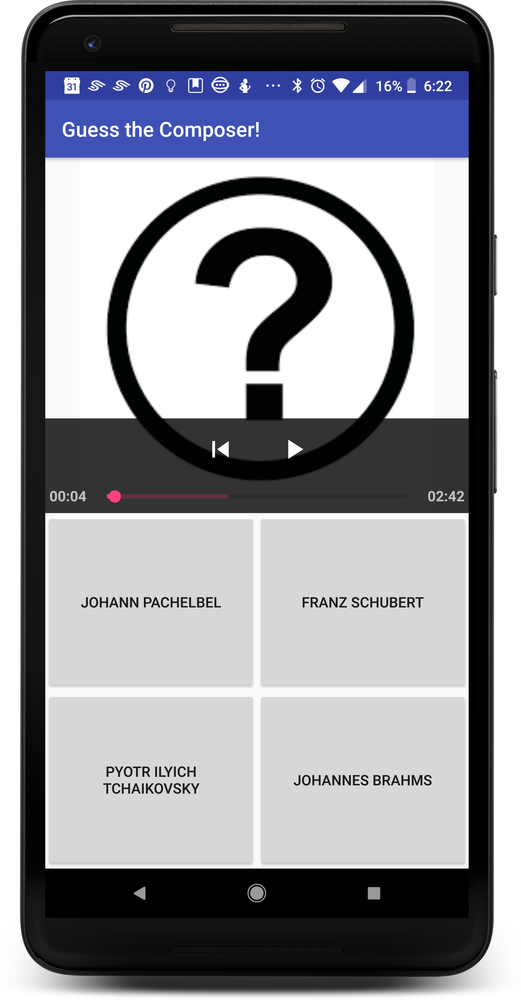

# Exercise 2 - Customize SimpleExoPlayerView

## *exo_playback_control_view.xml*
#### 1. Create a layout file called `exo_playback_control_view.xml` to override the playback control layout.[[code][1]]
```xml
<LinearLayout
    xmlns:android="http://schemas.android.com/apk/res/android"
    android:orientation="vertical"
    android:layout_width="match_parent"
    android:layout_height="match_parent"
    android:layout_gravity="bottom"
    android:layoutDirection="ltr"
    android:background="#CC000000">


    <LinearLayout
        android:layout_width="match_parent"
        android:layout_height="wrap_content"
        android:gravity="center"
        android:paddingTop="4dp"
        android:orientation="horizontal">


        <ImageButton
            android:id="@+id/exo_prev"
            style="@style/ExoMediaButton.Previous"/>


        <ImageButton
            android:id="@+id/exo_play"
            style="@style/ExoMediaButton.Play"/>


        <ImageButton
            android:id="@+id/exo_pause"
            style="@style/ExoMediaButton.Pause"/>


    </LinearLayout>


    <LinearLayout
        android:layout_width="match_parent"
        android:layout_height="wrap_content"
        android:layout_marginTop="4dp"
        android:gravity="center_vertical"
        android:orientation="horizontal">


        <TextView
            android:id="@+id/exo_position"
            android:layout_width="wrap_content"
            android:layout_height="wrap_content"
            android:textSize="14sp"
            android:textStyle="bold"
            android:paddingLeft="4dp"
            android:paddingRight="4dp"
            android:includeFontPadding="false"
            android:textColor="#FFBEBEBE"/>


        <SeekBar
            android:id="@+id/exo_progress"
            android:layout_width="0dp"
            android:layout_height="32dp"
            android:layout_weight="1"
            android:focusable="false"
            style="?android:attr/progressBarStyleHorizontal"/>


        <TextView
            android:id="@+id/exo_duration"
            android:layout_width="wrap_content"
            android:layout_height="wrap_content"
            android:textSize="14sp"
            android:textStyle="bold"
            android:paddingLeft="4dp"
            android:paddingRight="4dp"
            android:includeFontPadding="false"
            android:textColor="#FFBEBEBE"/>


    </LinearLayout>
```

## *Screenshots*



[1]: https://github.com/aaroncrutchfield/AdvancedAndroid_ClassicalMusicQuiz/blob/b513a1da9a803e065b38b256e271587e14d3f7d6/app/src/main/res/layout/exo_playback_control_view.xml#L4-L73


